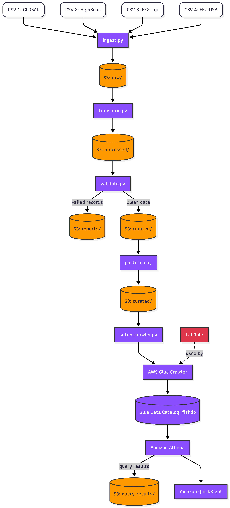

# Data Engineer (Role 1)
- **Name:** Jessica Abril Quintero Castillo

---

# Pipeline — Data Engineer (Role 1)

## Overview
This folder contains the scripts responsible for the ingestion, transformation, and cataloging stages of the data pipeline. These scripts move data from its original csv format into an optimized parquet format stored in a structured S3 Data Lake, and register the schema in the AWS Glue Data Catalog.

---

## Pipeline Flow



---

## S3 Data Lake Structure

```
s3://data-source-52143/
├── raw/          ← original csv files (Role 1)
├── processed/    ← cleaned parquet files with aligned schemas (Role 1)
└── curated/      ← quality-validated and partitioned by year (Role 2 + Role 3)
```

---

## Datasets

| File | Description | Schema changes |
|---|---|---|
| `SAU-GLOBAL-1-v48-0.csv` | Global high seas catch data (1950–2018) | None |
| `SAU-HighSeas-71-v48-0.csv` | Pacific Western Central high seas area | None |
| `SAU-EEZ-242-v48-0.csv` | Fiji Exclusive Economic Zone | `fish_name` → `common_name`, `country` → `fishing_entity` |
| `SAU_EEZ_848_v50-1.csv` | USA West Coast Exclusive Economic Zone | None |

---

## Scripts

### `ingest.py`
Creates a bucket named `data-source-52143` if it does not already exist.

Downloads the three official capstone csv files directly from the AWS source URLs and uploads them to the `raw/` zone in S3.

The fourth dataset (`SAU_EEZ_848_v50-1.csv`) is uploaded from a local file since it is not available via a public URL. The file is located in `datasets/SAU_EEZ_848_v50-1.csv`.

No data is modified at this stage.

**Run:**
```bash
python pipeline/ingest.py
```

---

### `transform.py`
Reads each csv from the `raw/` zone in S3, applies schema alignment where needed, converts to parquet format, and uploads the result to the `processed/` zone.

**Schema alignment applied:**
- `SAU-EEZ-242-v48-0.csv`: `fish_name` renamed to `common_name`, `country` renamed to `fishing_entity` to match the other datasets.
- All other files: no changes needed.

**Why Parquet?**

I used parquet because it has a columnar format. Athena only reads the columns needed by each query. Also, parquet, while compressed, is significantly smaller than csv. It provides fast queries.


**Run:**
```bash
python pipeline/transform.py
```

---

### `setup_crawler.py`
Creates the `fishdb` Glue database and `fishcrawler` crawler if they do not already exist, then runs the crawler against the `curated/` zone (after Role 2 validates the data and Role 3 partitions it) and waits for it to complete. Prints the list of tables created in the Glue Data Catalog.

**Run:**
```bash
python pipeline/setup_crawler.py
```

---

## Technical Decisions

- **Three S3 zones (`raw/`, `processed/`, `curated/`):** keeps the original files untouched in `raw/` so we can always go back to them. `processed/` holds the clean transformed data. `curated/` holds only data that passed Role 2's quality validations and was partitioned by Role 3.
- **Parquet instead of CSV:** Athena only reads the columns a query needs, not the whole file. This makes queries faster and cheaper.
- **Schema alignment in `transform.py`:** the EEZ-242 (Fiji) file used different column names (`fish_name`, `country`). We rename them before uploading so all four datasets share the same column names and Glue can catalog them consistently.
- **Crawler points to `curated/`:** by the time the crawler runs, the data is already validated by Role 2 and partitioned by Role 3.
- **Fourth dataset (EEZ-848 USA West Coast):** adds a second EEZ from a different country and region, which makes the analytics more interesting. It also brings extra columns (`scientific_name`, `gear_type`, `functional_group`) that the other files don't have.

---

## How to Reproduce

### Prerequisites
- Python 3.8+
- AWS CLI configured with valid credentials
- Required libraries:

```bash
pip install boto3 pandas pyarrow
```

### Steps

```bash
# 1. Ingest raw data into S3
python pipeline/ingest.py

# 2. Transform CSV to Parquet and align schemas
python pipeline/transform.py

# 3. (Role 2) validate data and move to curated/
python data_quality/validate.py

# 4. (Role 3) partition curated/ data by year
python analytics/partition.py

# 5. Create Glue database, crawler, and run it against curated/
python pipeline/setup_crawler.py
```

After these steps, the `fishdb` database in AWS Glue will contain four tables corresponding to the four datasets, partitioned by year and ready to be queried with Athena.